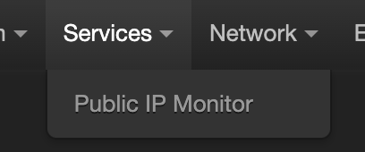
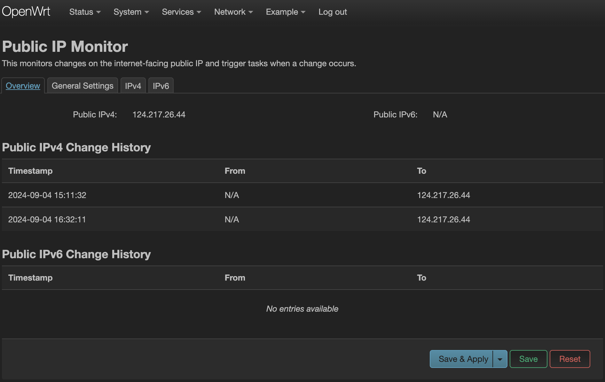
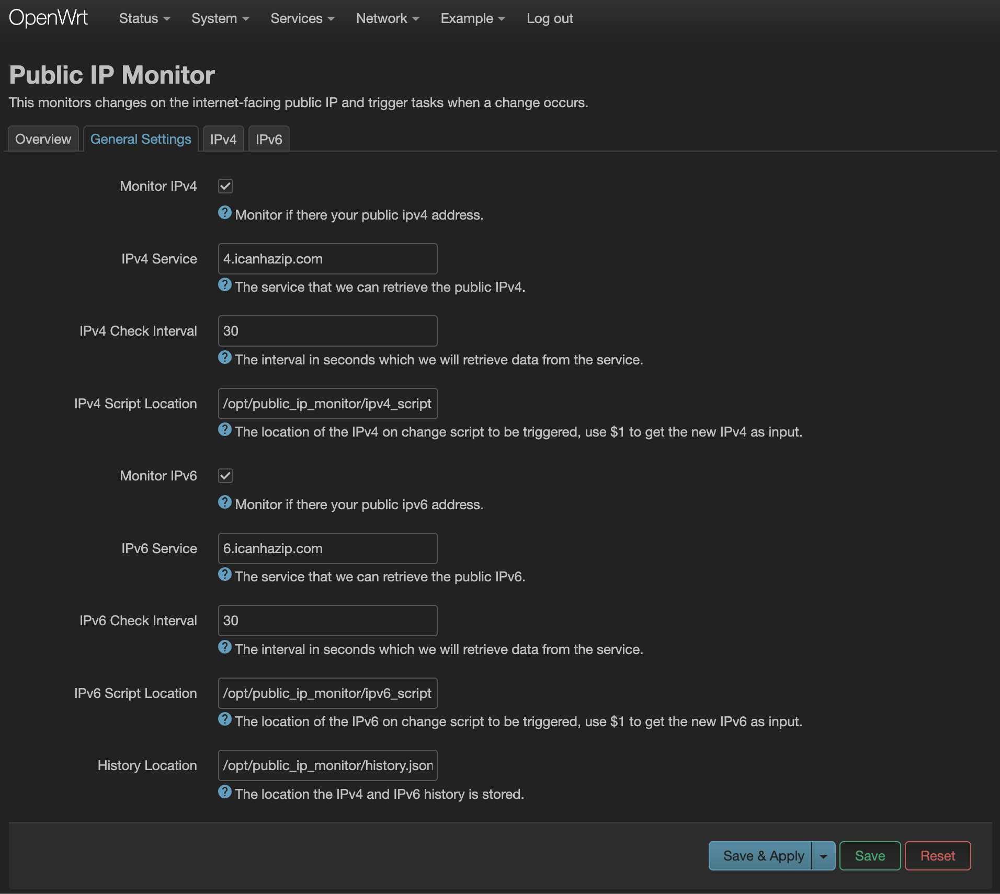
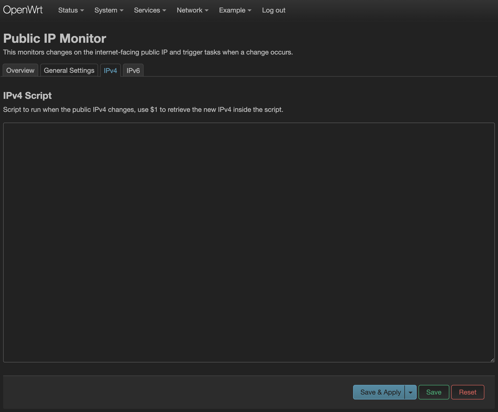

# Public IP Monitor

A LuCI application that monitors the internet-facing public IP of the current network.

This app can be used to run a script when a change to the public IP is detected.

Check the [Public IP Monitor Script](https://github.com/calfeche13/public-ip-monitor-script) for the command-line approach.

## Location

This is located under the "Services" tab.

## Overview

The overview displays the current IPv4 and IPv6 public addresses and the public ip change history.

## General Settings

The general settings tab is where you configure the app to monitor either IPv4 and IPv6 monitoring.

## On IP Change Scripts

Once an IP, either IPv4 or IPv6, changes, a script can be run for, the tab below allows editing the script via web interface.

